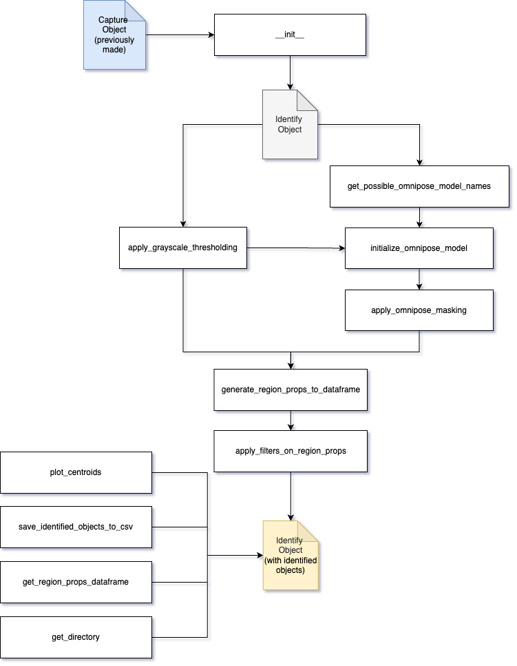

# Identify Class Documentation

## Overview

The `Identify` class in the Microbe Vision package is responsible for performing object identification on frames using methods such as grayscale thresholding and advanced models like Omnipose.

## Workflow



## Methods

### `__init__`

**Description**:
Initializes the `Identify` object with the specified `Capture` object.

#### Arguments

| Name                   | Type      | Explanation                                            | Optional | Default Value |
|------------------------|-----------|--------------------------------------------------------|----------|---------------|
| `capture_frame_object` | `Capture` | The `Capture` object used for identification.          | No       | N/A           |

#### Returns

| Type  | Explanation  |
|-------|--------------|
| `None` | The method does not return any value. |

#### Errors

- **`TypeError`**: Raised if `capture_frame_object` is not an instance of `Capture`.

---

### `show_frames`

**Description**:  
Displays a specified number of captured frames.

#### Arguments

| Name                 | Type  | Explanation                                             | Optional | Default Value |
|----------------------|-------|---------------------------------------------------------|----------|---------------|
| `images_to_show_count` | `int`  | The number of frames to display.                        | Yes      | `5`           |
| `use_gray_cmap`      | `bool` | Whether to display images in grayscale.                 | Yes      | `False`       |

#### Returns

| Type  | Explanation  |
|-------|--------------|
| `None` | The method does not return any value. |

#### Errors

- **`ValueError`**: Raised if the number of images to show is greater than the total number of images.

---

### `apply_grayscale_thresholding`

**Description**:  
Applies grayscale thresholding to the captured frames.

#### Arguments

| Name                 | Type   | Explanation                                                  | Optional | Default Value |
|----------------------|--------|--------------------------------------------------------------|----------|---------------|
| `threshold`          | `float`| The threshold value to use. Must be between 0 and 255.       | Yes      | `0.5`         |
| `is_update_frames`   | `bool` | Whether to update the captured frames with the thresholded images. | Yes      | `True`        |

#### Returns

| Type   | Explanation  |
|--------|--------------|
| `list` | The updated frames after applying grayscale thresholding. |

#### Errors

- **`ValueError`**: Raised if the threshold value is not between 0 and 255.

---

### `generate_region_props_to_dataframe`

**Description**:  
Generates region properties for the captured frames and returns them as a dataframe.

#### Arguments

| Name         | Type  | Explanation                                        | Optional | Default Value |
|--------------|-------|----------------------------------------------------|----------|---------------|
| `view_props` | `list` | The list of view properties to generate region properties for. | No       | N/A           |

#### Returns

| Type          | Explanation  |
|---------------|--------------|
| `pd.DataFrame` | The region properties dataframe. |

#### Errors

- **`ValueError`**: Raised if the `view_props` list is `None` or empty.

---

### `apply_filters_on_region_props`

**Description**:  
Applies filters on the region properties dataframe based on specified thresholds.

#### Arguments

| Name                | Type   | Explanation                                                    | Optional | Default Value |
|---------------------|--------|----------------------------------------------------------------|----------|---------------|
| `props_threshold`   | `list` | The list of property thresholds to apply.                      | No       | N/A           |
| `is_update_dataframes` | `bool` | Whether to update the region properties dataframe after filtering. | Yes      | `True`        |

#### Returns

| Type          | Explanation  |
|---------------|--------------|
| `pd.DataFrame` | The filtered region properties dataframe. |

---

### `get_possible_omnipose_model_names`

**Description**:  
Retrieves the possible Omnipose model names.

#### Arguments

| Name  | Type | Explanation | Optional | Default Value |
|-------|------|-------------|----------|---------------|
| None  | None | No arguments are required. | N/A | N/A |

#### Returns

| Type    | Explanation  |
|---------|--------------|
| `List[str]` | The list of possible Omnipose model names. |

---

### `initialize_omnipose_model`

**Description**:  
Initializes the Omnipose model.

#### Arguments

| Name      | Type   | Explanation                                  | Optional | Default Value       |
|-----------|--------|----------------------------------------------|----------|---------------------|
| `model_name` | `str`   | The name of the Omnipose model to use.       | Yes      | `'bact_phase_omni'` |
| `use_gpu` | `bool`  | Whether to use the GPU for the Omnipose model. | Yes      | `False`             |
| `params`  | `dict`  | The parameters to use for the Omnipose model. | Yes      | `OMNIPOSE_DEFAULT_PARAMS` |

#### Returns

| Type  | Explanation  |
|-------|--------------|
| `None` | The method does not return any value. |

---

### `apply_omnipose_masking`

**Description**:  
Segments objects using the Omnipose model.

#### Arguments

| Name               | Type   | Explanation                                                  | Optional | Default Value |
|--------------------|--------|--------------------------------------------------------------|----------|---------------|
| `batch_size`       | `int`  | The batch size for segmentation.                              | Yes      | `50`          |
| `save_masks`       | `bool` | Whether to save the generated masks.                         | Yes      | `False`       |
| `masks_store_path` | `str`  | The path to store the masks.                                 | Yes      | `'masks'`     |
| `is_update_frames` | `bool` | Whether to update the working frames with the segmented masks. | Yes      | `True`        |

#### Returns

| Type   | Explanation  |
|--------|--------------|
| `List` | The segmented masks. |

#### Errors

- **`ValueError`**: Raised if the Omnipose model is not initialized.

### `plot_centroids`

**Description**:  
Plots the centroids of the objects in the frames.

#### Arguments

| Name      | Type  | Explanation                               | Optional | Default Value |
|-----------|-------|-------------------------------------------|----------|---------------|
| `show_time` | `bool` | Whether to show the time (frame number) on the plot. | Yes      | `False`       |

#### Returns

| Type  | Explanation  |
|-------|--------------|
| `None` | The method does not return any value. |

---

### `save_identified_objects_to_csv`

**Description**:  
Saves the identified objects to a CSV file.

#### Arguments

| Name              | Type  | Explanation                                              | Optional | Default Value |
|-------------------|-------|----------------------------------------------------------|----------|---------------|
| `output_file_name` | `str`  | The name of the output CSV file.                          | Yes      | `'identified_objects'` |

#### Returns

| Type  | Explanation  |
|-------|--------------|
| `None` | The method does not return any value. |

---

### `get_region_props_dataframe`

**Description**:  
Retrieves the region properties dataframe containing the calculated properties of the identified regions.

#### Arguments

| Name  | Type | Explanation | Optional | Default Value |
|-------|------|-------------|----------|---------------|
| None  | None | No arguments are required. | N/A | N/A |

#### Returns

| Type          | Explanation  |
|---------------|--------------|
| `pd.DataFrame` | The dataframe containing region properties such as area, perimeter, centroid, etc. |

---

### `get_directory`

**Description**:  
Retrieves the working directory where files are stored.

#### Arguments

| Name  | Type | Explanation | Optional | Default Value |
|-------|------|-------------|----------|---------------|
| None  | None | No arguments are required. | N/A | N/A |

#### Returns

| Type  | Explanation  |
|-------|--------------|
| `str` | The working directory path. |

## Example Workflow

```python
from identify import Identify
from constants import AvailableProps, AvailableOperations

# Resupply the Capture object and initialize Identify object
identify = Identify(capture)

# Show a few frames
identify.show_frames(images_to_show_count=1, use_gray_cmap=True)

# Apply grayscale thresholding to the frames
thresholded_frames = identify.apply_grayscale_thresholding(threshold=0.25, is_update_frames=True)
identify.show_frames(images_to_show_count=1, use_gray_cmap=True)

# Apply grayscale thresholding - another value
thresholded_frames = identify.apply_grayscale_thresholding(threshold=0.52, is_update_frames=True)
identify.show_frames(images_to_show_count=1, use_gray_cmap=True)

# Alternatively - Use Omnipose
identify.initialize_omnipose_model(model_name='bact_phase_omni', use_gpu=True)

# Apply Omnipose model
masks = identify.apply_omnipose_masking(batch_size=50, save_masks=True, masks_store_path='masks', is_update_frames=True)

# Display frames after applying omnipose
identify.show_frames(images_to_show_count=1, use_gray_cmap=True)

# Generate region properties DataFrame
view_props = [
    AvailableProps.LABEL,
    AvailableProps.AREA,
    AvailableProps.CENTROID,
    AvailableProps.MAJOR_AXIS_LENGTH,
    AvailableProps.MINOR_AXIS_LENGTH
]

# Generate region properties for the frames
region_props_df = identify.generate_region_props_to_dataframe(view_props)

# Apply filters on region properties
props_threshold: List[PropsThreshold] = [
    {
        'property': AvailableProps.AREA,
        'operation': AvailableOperations.GREATER_THAN,
        'value': 86
    },
    {
        'property': AvailableProps.AREA,
        'operation': AvailableOperations.LESS_THAN,
        'value': 80
    },

]

# Apply filters on the generated region properties
filtered_df = identify.apply_filters_on_region_props(props_threshold)


# Plot centroids of the identified regions
identify.plot_centroids(show_time=True)

# Save identified objects to a CSV file
identify.save_identified_objects_to_csv(output_file_name='identified_objects')

```

## PropsThreshold Structure

The `PropsThreshold` is a structure used to define thresholds for filtering region properties in the `apply_filters_on_region_props` method. Each `PropsThreshold` is a dictionary with the following structure:

### Structure of `PropsThreshold`

| Key        | Description                                             | Type              | Example Value                   |
|------------|---------------------------------------------------------|-------------------|----------------------------------|
| `property` | The property to filter on.                              | `AvailableProps`  | `AvailableProps.AREA`            |
| `operation`| The operation to apply for filtering.                   | `AvailableOperations` | `AvailableOperations.GREATER_THAN` |
| `value`    | The threshold value to compare against.                 | `float` or `int`  | `100`                            |

### Example of a `PropsThreshold`

```python
from constants import AvailableProps, AvailableOperations

threshold = {
    "property": AvailableProps.AREA,
    "operation": AvailableOperations.GREATER_THAN,
    "value": 100
}
```

This example filters objects based on their `AREA`, keeping only those with an area greater than 100.

## Enums for `PropsThreshold`

### AvailableProps

The `AvailableProps` enum provides different properties that can be used for filtering in the `PropsThreshold` structure.

| Enum Value            | Description                                |
|-----------------------|--------------------------------------------|
| `AREA`                | The area of the object.                    |
| `PERIMETER`           | The perimeter of the object.               |
| `CENTROID`            | The centroid (x, y coordinates) of the object. |
| `MAJOR_AXIS_LENGTH`   | The length of the major axis of the object.|
| `MINOR_AXIS_LENGTH`   | The length of the minor axis of the object.|
| `ECCENTRICITY`        | The eccentricity of the object.            |

### AvailableOperations

The `AvailableOperations` enum defines the comparison operations that can be applied in the `PropsThreshold`.

| Enum Value            | Description                                |
|-----------------------|--------------------------------------------|
| `GREATER_THAN`        | Checks if the property value is greater than the specified threshold. |
| `LESS_THAN`           | Checks if the property value is less than the specified threshold. |
| `EQUALS`              | Checks if the property value is equal to the specified threshold. |

### Example of Using Multiple `PropsThreshold`

You can use multiple thresholds to filter based on various properties:

```python
from constants import AvailableProps, AvailableOperations

thresholds = [
    {
        "property": AvailableProps.AREA,
        "operation": AvailableOperations.GREATER_THAN,
        "value": 100
    },
    {
        "property": AvailableProps.PERIMETER,
        "operation": AvailableOperations.LESS_THAN,
        "value": 50
    }
]
```

In this example, objects are filtered to include those with an area greater than 100 and a perimeter less than 50.
