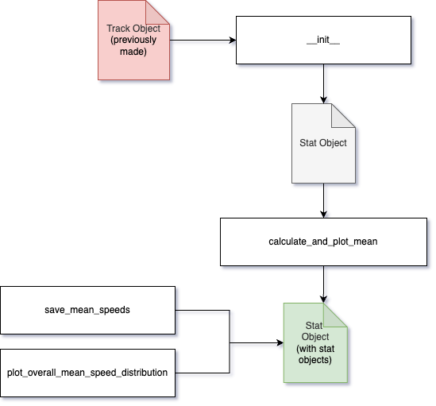

# Stats Class Documentation

## Overview

The `Stats` class in the RabtPy package is responsible for analyzing particle motion and calculating speed distributions. It provides functionality to calculate mean speeds, fit distributions, and save the analyzed data.

## Workflow



## Class Attributes

| Attribute             | Description                                                      | Default Value |
|-----------------------|------------------------------------------------------------------|---------------|
| `DEFAULT_DISTRIBUTION`| The default distribution type used for fitting speed data.       | `'norm'`      |

## Public Methods

### `__init__`

**Description**:  
Initializes the `Stats` object with the specified `Tracker` object, setting up the necessary data for motion analysis.

#### Arguments

| Name              | Type    | Explanation                                              | Optional | Default Value |
|-------------------|---------|----------------------------------------------------------|----------|---------------|
| `tracker_object` | `Tracker` | The `Tracker` object used to retrieve linked particle data. | No       | N/A           |

#### Returns

| Type  | Explanation  |
|-------|--------------|
| `None` | The method does not return any value. |

---

### `calculate_and_plot_mean`

**Description**:  
Calculates the mean speed for each particle and plots the speed distributions.

#### Arguments

| Name              | Type    | Explanation                                              | Optional | Default Value               |
|-------------------|---------|----------------------------------------------------------|----------|-----------------------------|
| `plots_per_row`   | `int`   | Number of plots per row in the grid.                     | Yes      | `4`                         |
| `distribution_type` | `any`   | Distribution type to fit. Check the distfit documentation for more options. | Yes      | `DEFAULT_DISTRIBUTION`      |

#### Returns

| Type         | Explanation  |
|--------------|--------------|
| `np.ndarray` | Array of mean speeds for each particle. |

---

### `plot_overall_mean_speed_distribution`

**Description**:  
Plots the overall mean speed distribution for all particles.

#### Arguments

| Name               | Type    | Explanation                                              | Optional | Default Value               |
|--------------------|---------|----------------------------------------------------------|----------|-----------------------------|
| `distribution_type` | `any`   | Distribution type to fit the overall mean speeds.       | Yes      | `DEFAULT_DISTRIBUTION`      |

#### Returns

| Type  | Explanation  |
|-------|--------------|
| `None` | The method does not return any value. |

---

### `save_mean_speeds`

**Description**:  
Saves the calculated mean speeds for each particle to a CSV file.

#### Arguments

| Name        | Type  | Explanation                                         | Optional | Default Value |
|-------------|-------|-----------------------------------------------------|----------|---------------|
| `filename`  | `str` | The name of the output CSV file.                     | No       | N/A           |

#### Returns

| Type  | Explanation  |
|-------|--------------|
| `None` | The method does not return any value. |

---

## Example Workflow

```python
from stats import Stats

# Initialize the Stat objects using previous made tracker object
stats = Stats(tracker_object=tracker)

# Calculate and plot mean speeds
mean_speeds = stats.calculate_and_plot_mean(plots_per_row=3, distribution_type='norm')

# Plot overall mean speed distribution
stats.plot_overall_mean_speed_distribution(distribution_type='norm')

# Save mean speeds to a CSV file
stats.save_mean_speeds(filename='mean_speeds')
```
