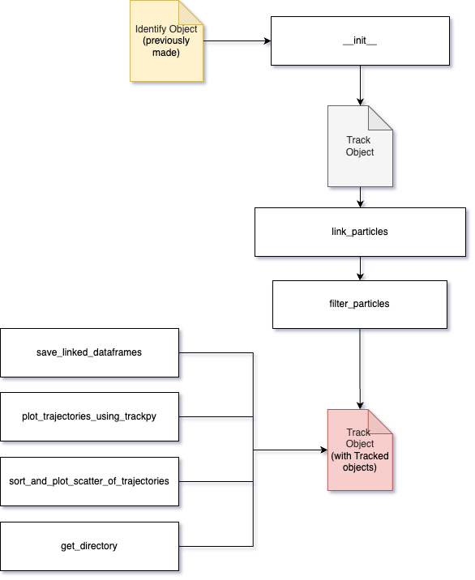

# Tracker Class Documentation

## Overview

The `Tracker` class is responsible for tracking particles in 2D using the Trackpy library. It integrates with an `Identify` object to obtain region properties from processed frames, then links and filters particle trajectories across frames. The class also supports various visualization methods including plotting trajectories, scatter plots of sorted trajectories, and overlaying particle tracks on video frames with customizable aesthetics.

## Workflow



1. **Initialization:**  
   An instance is created using an `Identify` object. The class extracts the region properties dataframe, working directory, capture speed, and pixel scale factor from the parent objects.
2. **Linking Particles:**  
   The `link_particles` method uses Trackpy’s `link_df` to link particles across frames based on position and a user-defined maximum movement and memory.
3. **Filtering Trajectories:**  
   The `filter_particles` method filters linked particles based on the number of frames present and the overall displacement.
4. **Data Saving and Visualization:**  
   Methods are available to save the linked particle data to CSV, plot trajectories using Trackpy, create scatter plots of trajectories, and overlay tracks on video frames.
5. **Video Overlay:**  
   The `overlay_tracks_on_video` method draws particle trajectories with unique colors onto the video frames, with options for adding particle ID labels and adjusting for indexing differences.

## Class Attributes

| Attribute                    | Description                                           | Default Value                          |
|------------------------------|-------------------------------------------------------|----------------------------------------|
| `DEFAULT_POSITION_COLUMNS`   | Default columns for x and y positions for tracking.   | `['centroid_x', 'centroid_y']`         |

---

## Public Methods

### `__init__(identify_object: Identify) -> None`

**Description:**  
Initializes the Tracker instance with the provided `Identify` object and sets up internal data structures for tracking particles.

**Arguments:**

| Name              | Type      | Explanation                                                     | Optional | Default Value |
|-------------------|-----------|-----------------------------------------------------------------|----------|---------------|
| `identify_object` | `Identify`| The Identify object that provides the region properties dataframe and related metadata. | No       | N/A           |

**Returns:**

- `None`

**Errors:**

- **`TypeError`**: Raised if `identify_object` is not an instance of `Identify`.

---

### `link_particles(max_distance: float, max_memory: int, position_columns: list[str] = ['centroid_x', 'centroid_y']) -> pd.DataFrame`

**Description:**  
Links particles across frames based on their positions using Trackpy’s linking algorithm. The method updates the internal dataframe with linked trajectories.

**Arguments:**

| Name               | Type        | Explanation                                                            | Optional | Default Value                           |
|--------------------|-------------|------------------------------------------------------------------------|----------|-----------------------------------------|
| `max_distance`     | `float`     | Maximum distance a particle can move between frames to be considered linked. | No       | N/A                                     |
| `max_memory`       | `int`       | Maximum number of frames a particle can vanish before being lost.       | No       | N/A                                     |
| `position_columns` | `list[str]` | List of column names for the x and y positions used for linking.         | Yes      | `['centroid_x', 'centroid_y']`          |

**Returns:**

- `pd.DataFrame`: DataFrame containing the linked particles.

---

### `filter_particles(min_frames: int, min_displacement: float, is_update_particles: bool = True) -> pd.DataFrame`

**Description:**  
Filters linked particles based on their persistence (minimum number of frames) and displacement over time.  
- First, particles present in fewer than the specified number of frames are removed using Trackpy’s `filter_stubs`.  
- Then, particles with displacement below the minimum threshold are filtered out.

**Arguments:**

| Name                  | Type   | Explanation                                                        | Optional | Default Value |
|-----------------------|--------|--------------------------------------------------------------------|----------|---------------|
| `min_frames`          | `int`  | Minimum number of frames a particle must be present to be retained.  | No       | N/A           |
| `min_displacement`    | `float`| Minimum displacement (in units consistent with the pixel scale) required for a particle. | No       | N/A           |
| `is_update_particles` | `bool` | Whether to update the internal linked particles dataframe with the filtered results. | Yes      | `True`        |

**Returns:**

- `pd.DataFrame`: DataFrame containing the filtered particles.

**Errors:**

- **`ValueError`**: Raised if there are no linked dataframes available (i.e., if `link_particles` has not been called).

---

### `save_linked_dataframes(output_file_name: str) -> None`

**Description:**  
Saves the linked particles dataframe to a CSV file in the working directory.  
- A copy of the dataframe is made and two additional columns (`new_x` and `new_y`) are added by swapping the centroid coordinates.

**Arguments:**

| Name                | Type  | Explanation                                               | Optional | Default Value |
|---------------------|-------|-----------------------------------------------------------|----------|---------------|
| `output_file_name`  | `str` | The base name for the CSV file (e.g., "Linked_Particles").   | No       | N/A           |

**Returns:**

- `None`

**Errors:**

- **`ValueError`**: Raised if the linked dataframe is empty (i.e., if `link_particles` has not been called).

---

### `plot_trajectories_using_trackpy() -> None`

**Description:**  
Plots the trajectories of linked particles using Trackpy’s built-in plotting function.  
- The method utilizes the reversed order of position columns for correct plotting.

**Arguments:**

| Name | Type | Explanation                                  | Optional | Default Value |
|------|------|----------------------------------------------|----------|---------------|
| None | None | No arguments are required.                   | N/A      | N/A           |

**Returns:**

- `None`

**Errors:**

- **`ValueError`**: Raised if there are no linked dataframes available (i.e., if `link_particles` has not been called).

---

### `sort_and_plot_scatter_of_trajectories(is_update_particles: bool = True) -> None`

**Description:**  
Sorts the linked particles dataframe by particle and frame, then creates a scatter plot of their trajectories using Seaborn.  
- If specified, the internal dataframe is updated with the sorted data.

**Arguments:**

| Name                  | Type   | Explanation                                                    | Optional | Default Value |
|-----------------------|--------|----------------------------------------------------------------|----------|---------------|
| `is_update_particles` | `bool` | Whether to update the internal dataframe with the sorted result. | Yes      | `True`        |

**Returns:**

- `None`

**Errors:**

- **`ValueError`**: Raised if there are no linked dataframes available.

---

### `overlay_tracks_on_video(output_video_filename: str, colormap_name: str = "viridis", frame_index_offset: int = -1, show_labels: bool = True, font_scale: float = 0.5, font_thickness: int = 1, label_offset_x: int = 5, label_offset_y: int = -5) -> None`

**Description:**  
Overlays particle trajectories onto the video frames and saves the output as a new video file.  
- Retrieves captured frames from the underlying `Capture` object.
- Uses a colormap (default `"viridis"`) to assign unique colors to each particle.
- Adjusts frame indexing using `frame_index_offset` to align tracking data with video frames.
- Optionally overlays particle ID labels at the last tracked position.

**Arguments:**

| Name                   | Type   | Explanation                                                                                                                                        | Optional | Default Value    |
|------------------------|--------|----------------------------------------------------------------------------------------------------------------------------------------------------|----------|------------------|
| `output_video_filename`| `str`  | The file name for the output video with overlaid tracks.                                                                                           | No       | N/A              |
| `colormap_name`        | `str`  | The name of the matplotlib colormap to use for assigning unique particle colors (e.g., `"viridis"`, `"plasma"`, `"jet"`).                           | Yes      | `"viridis"`      |
| `frame_index_offset`   | `int`  | An offset to adjust for frame index differences between the tracking data and video frames (e.g., `-1` if tracking starts at 1 and video at 0).      | Yes      | `-1`             |
| `show_labels`          | `bool` | Whether to overlay particle ID labels on the video frames.                                                                                         | Yes      | `True`           |
| `font_scale`           | `float`| Font scale for the particle ID labels.                                                                                                             | Yes      | `0.5`            |
| `font_thickness`       | `int`  | Thickness of the label text.                                                                                                                       | Yes      | `1`              |
| `label_offset_x`       | `int`  | Horizontal offset for label placement relative to the last tracked position.                                                                       | Yes      | `5`              |
| `label_offset_y`       | `int`  | Vertical offset for label placement relative to the last tracked position.                                                                         | Yes      | `-5`             |

**Returns:**

- `None`

**Errors:**

- **`ValueError`**:  
  - Raised if there are no captured frames available (i.e., if the video has not been loaded and processed by the `Capture` class).  
  - Raised if the tracking data is empty (i.e., if `link_particles` has not been called).

---

### `get_directory() -> str`

**Description:**  
Retrieves the working directory where output files (e.g., CSVs, videos) are stored.

**Arguments:**

| Name | Type | Explanation                                  | Optional | Default Value |
|------|------|----------------------------------------------|----------|---------------|
| None | None | No arguments are required.                   | N/A      | N/A           |

**Returns:**

- `str`: The working directory path.

---

## Example Workflow

```python
from tracker import Tracker

# Assume 'identify' is an already instantiated Identify object

# Initialize the Tracker with the Identify object
tracker = Tracker(identify_object=identify)

# Link particles using specified max distance and memory
linked_particles = tracker.link_particles(max_distance=50, max_memory=50, position_columns=['centroid_x', 'centroid_y'])

# Filter particles based on minimum frame presence and displacement
filtered_particles = tracker.filter_particles(min_frames=500, min_displacement=10, is_update_particles=True)

# Save the linked particle data to a CSV file
tracker.save_linked_dataframes(output_file_name='Linked_Particles')

# Plot trajectories using Trackpy's plotting functions
tracker.plot_trajectories_using_trackpy()

# Sort the linked particles and plot a scatter plot of their trajectories
tracker.sort_and_plot_scatter_of_trajectories(is_update_particles=True)

# Overlay the particle trajectories on the video and save the output video
output_video_filename = "Flavo_case_tracks_overlaid.avi"
tracker.overlay_tracks_on_video(
    output_video_filename=output_video_filename,
    colormap_name="viridis",
    frame_index_offset=-1,  # Adjust based on tracking and video frame indices
    show_labels=True,
    font_scale=0.5,
    font_thickness=1,
    label_offset_x=5,
    label_offset_y=-5
)

# Retrieve the working directory
working_dir = tracker.get_directory()
print("Output files are stored in:", working_dir)
```
